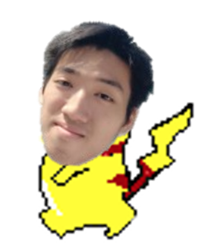
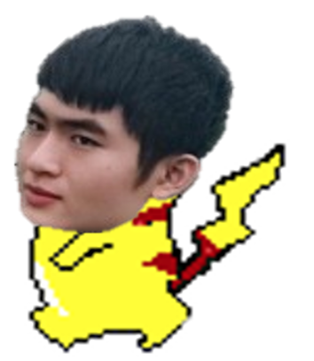
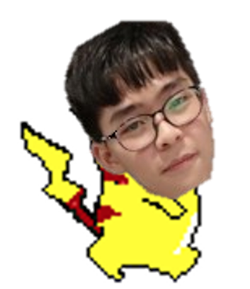
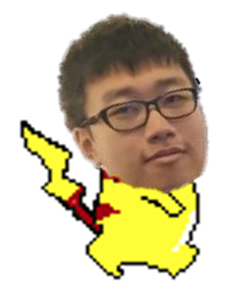
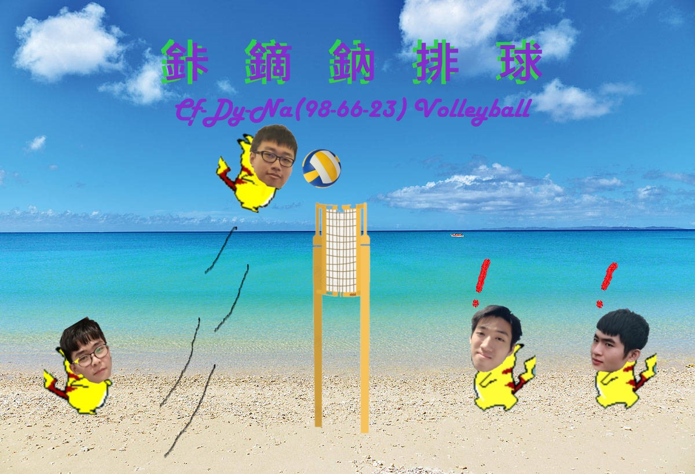
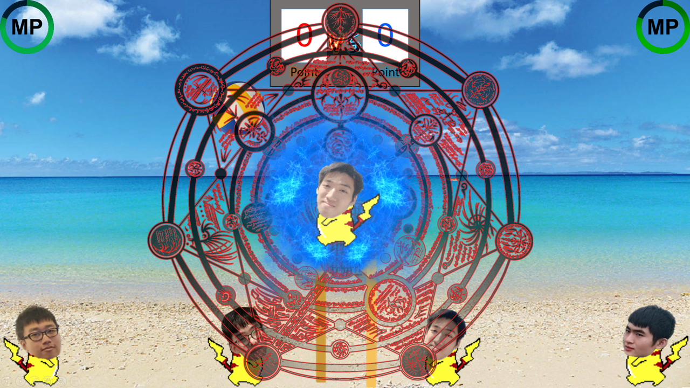
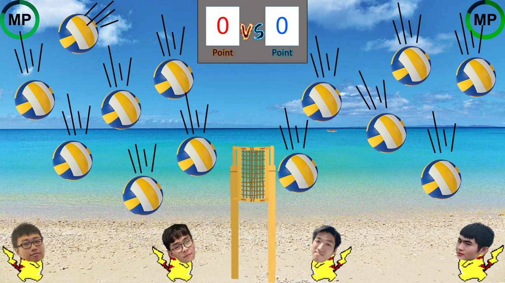
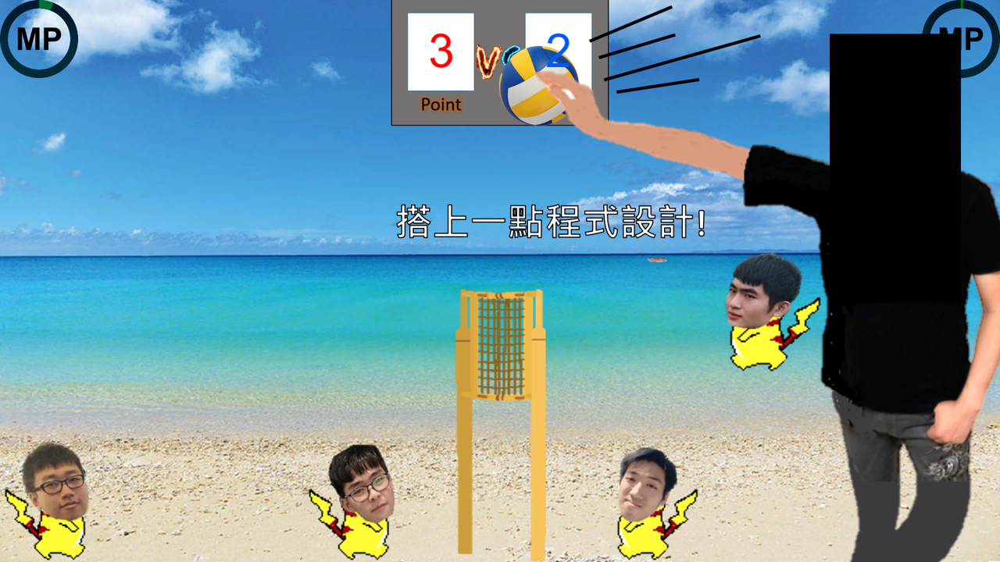
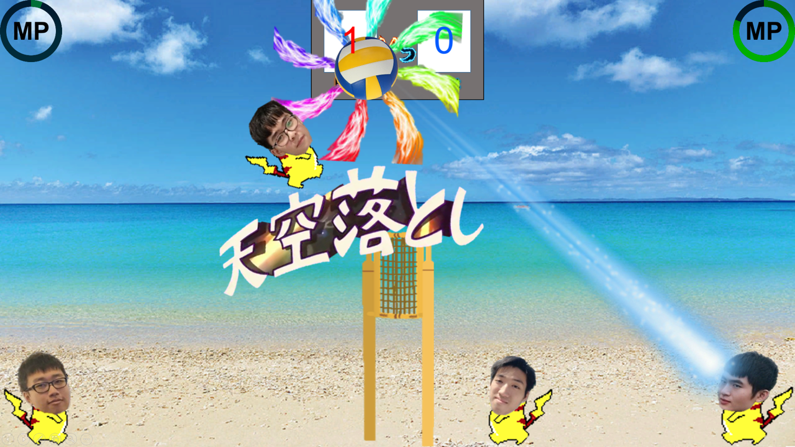
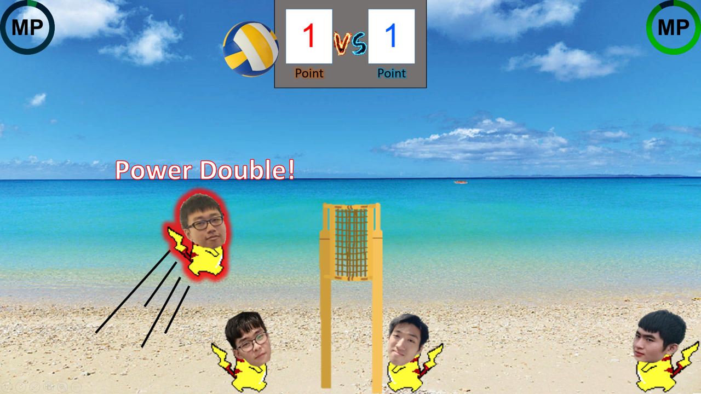

<html>
<head>
 <title>鉲鏑鈉排球</title>
 </head>

<body>
 
 <h1>
 鉲鏑鈉排球

 
 </h1>
  
 

 <h1>
 目錄
  
 <ul>
    <a href="https://jafarwu.github.io/motivation"> <li>動機</li></a>
    <li>內容</li>
    <li>必殺技</li>
  </ul>
</h1>

 
  
 

  <h3>製作遊戲的動機!!</h3>
   <ol>
   <li>作業需求</li>
    <li>想玩遊戲</li>
    <li>覺得很厲害</li>
  </ol>
  
  
   
 

 <h3>遊戲內容</h3>
  }
  <ul>
    <li>以同學頭像為基礎的角色</li>
   </ul>
 
 

  
 
 

操作方法:
 
 

 [跳:5鍵 前進:1鍵 後退:3鍵 必殺技:2鍵](上圖) 
 
 
 

   
    
 

 操作方法:
  
 

 [跳:上箭頭 前進:左箭頭 後退:右箭頭 必殺技:下箭頭](上圖) 
 
 
 

   
    
 

 操作方法:
  
 

 [跳:I鍵 前進:J鍵 後退:L鍵 必殺技:K鍵](上圖) 
 
 
 

   
    
 

 操作方法:
  
 

 [跳:W鍵 前進:A鍵 後退:D鍵 必殺技:S鍵](上圖) 

 
 
 

  <ul>
    <li>排球為主的遊戲</li>
    
   </ul>
   
 
 

 
 <h3>必殺技</h3>
  
  必殺技需要能量條滿80%後才能使用(一次消耗80%)，每次碰到球可加能量10點
  

 
 

   1.柏X技能
   技能介紹:召喚出無數顆球 但只有一顆是真的 碰到召喚出來的假球也會累積能量
   
    
    
   
 

   2.仲X技能
   技能介紹:召喚出魔王殺球，可極限救球，太OP啦。(魔王是帥哥，他說的)
   
   
   
 

  3.至X技能
  技能介紹:角色飛到空中，將球吸到腳色前，在蓄力幾秒後殺球，殺球的角度每次都不一樣!
   
   
   
 

  4.榮X技能
  技能介紹:角色力量及速度爆表，能力直接變兩倍(警告!可能會飛出視窗外，一去不復返)
   
  

  
 

  遊戲載點:
   
 

  
   
 

   介紹到此，謝謝觀賞!
    
</body>
</html> 
